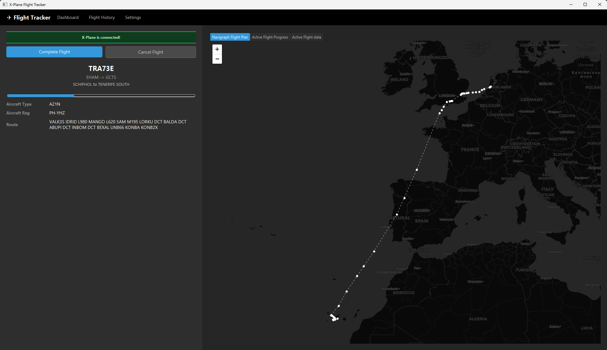
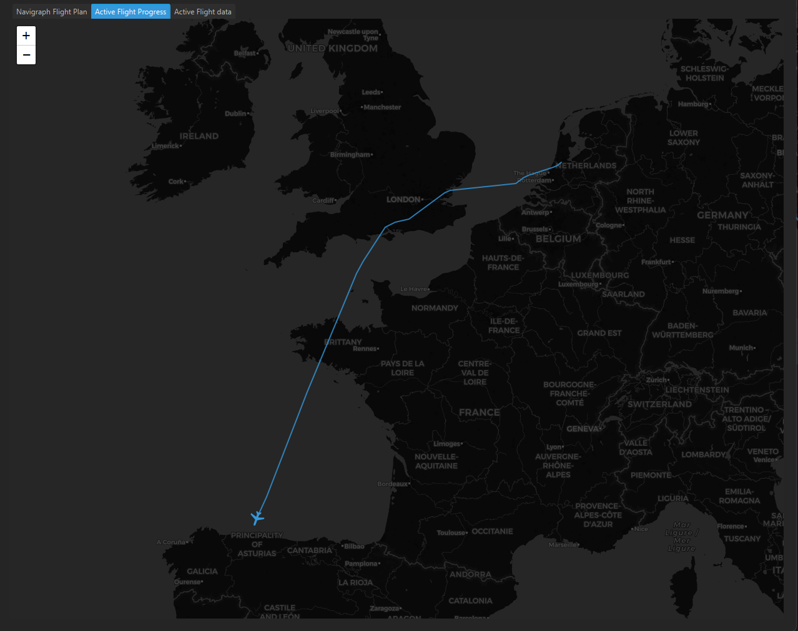
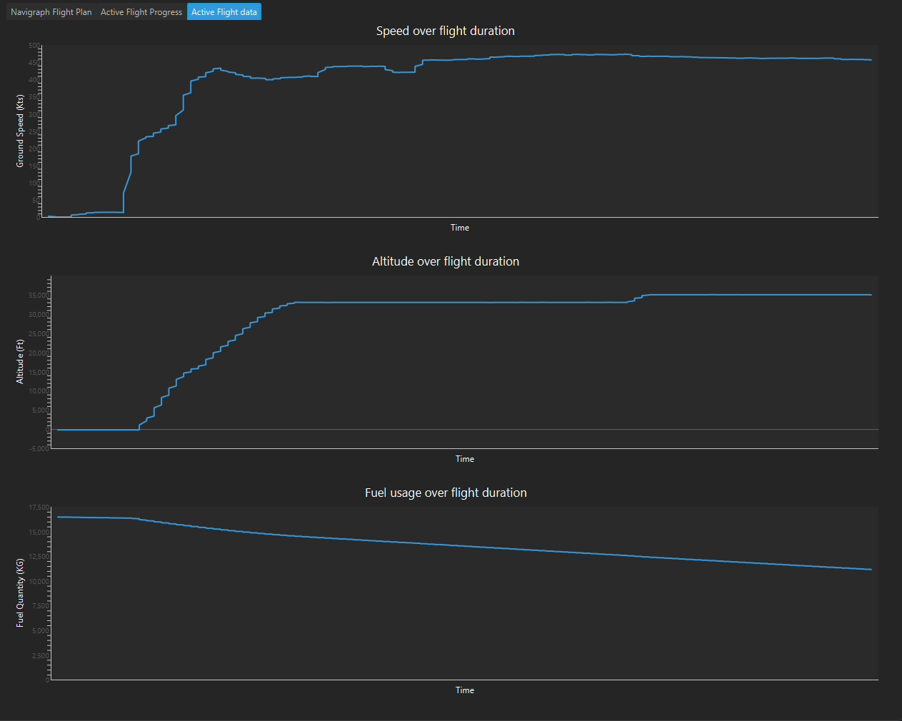

# X-Plane Flight Tracker

Laminar research recently implemented a REST API into X-Plane (https://developer.x-plane.com/article/x-plane-web-api/). 
The API allows users to read/write dataref values and subscribe to web sockets. 

I have always wanted to build something that interacts with the sim but have never got round to learning 
C++ in order to do so (watch this space). This API presented a good opportunity to have a bit of a play around. 

For the last few years I have written nothing but Spring Boot back ends for React or NextJS apps and I wanted 
to try something new so chose to build this system using Java FX, without any inversion of control, dependency injection 
or ORM frameworks. 

I know I could have written it using TypeScript and Electron but I hate myself, so chose not to. 

## Functionality

The application currently offers the following functionality: 

- Pull data from Simbrief (https://www.simbrief.com/home/) to create a flight
- Connect to X-Plane to track flight events
- View historic flights
- Some basic configurable application settings

### Simbrief Connection 

The application currently requires the user to have a Simbrief account as this is where the majority of flight and 
aircraft information is collected from when starting a flight.

### X-Plane Connection 

Once a flight has been started using Simbrief, the application polls the X-Plane API every 15 seconds to collect 
point-in-time information about the following datarefs: 

- Latitude
- Longitude
- Heading 
- Ground speed (Knots)
- Pressure altitude
- Engines running (Boolean)
- Fuel quantity (Kilograms)
- Simulator time (Zulu)

These events are saved to a SQLite database and are used to populate a number of screens, maps, charts and graphs which can be seen below. 

### Settings 
The settings screen allows users to update the following settings: 

- X-Plane host: Defaults to http://localhost:8086/api/v2/datarefs but is configurable in the simulator so I have made this configurable. 
- Simbrief Username: Required to use the application - is never stored anywhere other than on the user's local machine in the SQLite database. 
- Monitor Screenshots: A radio button that tells the app whether you want it to monitor and copy screenshots taken during the active flight. 
- Screenshot directory: The directory to be monitored for new screenshots. 

### Flight History 
The flight history screen contains information about previous flights, as well as a hero image screenshot if one is available.

## Dashboard

The dashboard is the main screen of the application and can be found in one of two states: 

- Active flight
- No active flight

### Active Flight

If an active flight is detected, the dashboard screen will display basic flight information, a real-time progress bar, 
a status indicator about whether or not X-Plane is connected, as well as the option to complete or cancel the active 
flight.

The right hand side of the screen currently contains three tabs:

- Navigraph Flight Plan: Contains a map with the planned route drawn on it. This data is taken from Simbrief.
- Active Flight Progress: Contains a second map with the flight's real-time progress plotted on it as well as an icon indicating the aircraft's current heading.
- Active Flight Data: Contains three line graphs displaying the aircraft's altitude, ground speed and fuel quantity over the duration of the flight. 

### Navigraph Flight Plan
The active flight plan map contains Simbrief flight information only. This includes route information and waypoint information.  
Each waypoint can be clicked to open a popup containing further information about it. 

The plan is to expand this map and eventually include alternate airport info and ETOPS info if applicable. 
Also a general update to the look and feel to help users differentiate between SID, STAR, TOC, TOD, Departure and Arrival airports is planned. 

### Active Flight Progress
The active flight progress map contains a route that is depicted from actual simulator data, as well as a SVG aircraft 
icon that allows the user to quickly see which heading the aircraft is currently on. 

This information is more granular than the Simbrief information as it is actually taken from the sim. 
The plan going forward would be to overlay waypoint information and potentially VATSIM FIR information if the flight is online. 

### Active Flight Data 
The active flight data tab contains three line graphs that display the altitude, speed and fuel quantity across the duration 
of the flight. The plan going forward would be to derive some more complex data points and draw these into graphs and charts - 
potentially things such as fuel burn per hour, etc. 

## Flight History
The flight history page contains a selectable list of all the user's previously tracked flights. It acts in much the same
way as the dashboard in how it displays data. It has an additional tab that displays general flight information and a hero image for the flight if one is available. 

The plan for this page going forward is to load all the user's screenshots from the flight into a new tab and open the default
image viewer when they are clicked. Also I would like to save the PDF flight plan from Simbrief and make this available
on this screen. 

